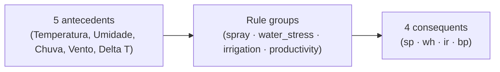

# fuzzy-lab — Agricultural decision support with fuzzy logic

Weather-driven IF–THEN inference for spray windows, water stress, irrigation hints, and yield estimates.

## What It Does

Turns weather variables (temperature, humidity, rainfall, wind, delta T) into agronomic recommendations:

- Recommends a spray window (`proibida` / `atencao` / `janela_disponivel`) from delta T, wind, rain, humidity, and temperature.
- Estimates water stress and derives an irrigation hint (`desnecessaria` / `opcional` / `recomendada`).
- Estimates relative productivity (`baixa` / `medio` / `alta`).
- Exposes a single programmatic entry point: `build_system()` + `run_inference()`.

## What It Is

A modular **Python library and research codebase** (import name `fuzzylab`) for fuzzy inference in precision agriculture. It produces crisp, defuzzified recommendations from fuzzy IF–THEN rules, addressing the rigidity of crisp threshold models when weather variables interact near operational limits. The active core is a Mamdani FIS (scikit-fuzzy); a PyTorch ANFIS and a time-series layer are scaffolded.

## Tech Stack

| Layer | Technology |
|-------|------------|
| Language | Python 3.10+ |
| Fuzzy inference | scikit-fuzzy (Mamdani), NumPy |
| Neuro-fuzzy | PyTorch (ANFIS) |
| Time series | Pandas, tslearn |
| Testing | pytest |
| Experimentation | Jupyter Notebook |
| Visualization | matplotlib |

## Architecture

`src/`-layout package split by feature: `fuzzylab.fis` (active Mamdani system), `fuzzylab.anfis` (neuro-fuzzy, scaffolded), and `fuzzylab.timeseries` (placeholder). The Mamdani flow:



`build_system(config)` assembles a `ControlSystemSimulation` from the selected rule groups; `run_inference(system, inputs)` computes and returns the defuzzified outputs. Each antecedent uses 7 membership functions (`automf`), and rule groups are independently selectable via `config={"rule_groups": [...]}`.

## Getting Started

### Prerequisites

- Python 3.10 or newer
- pip
- (Optional) CUDA for GPU-accelerated PyTorch in the ANFIS module

### Installation

```bash
git clone https://github.com/LukeSantossz/fuzzy-lab.git
cd fuzzy-lab

python -m venv venv
source venv/bin/activate     # Linux / macOS
# venv\Scripts\activate      # Windows

pip install -r requirements.txt
pip install -e .             # editable install; import name: fuzzylab
```

Without `pip install -e .`, add `src` to `PYTHONPATH` or rely on the notebook snippet that prepends `.../src` to `sys.path`.

### Running

```bash
jupyter notebook             # main experiment: notebooks/fis_mamdani.ipynb
```

Membership-function plots and 3D control surfaces are saved under `notebooks/figures/`.

### Tests

```bash
pytest tests/
```

## API Reference

```python
from fuzzylab.fis import build_system, run_inference

system = build_system()  # or build_system({"rule_groups": ["spray", "irrigation"]})
outputs = run_inference(
    system,
    {"Temperatura": 28.0, "Umidade": 60.0, "Chuva": 0.0, "Vento": 10.0, "Delta T": 8.0},
)
print(outputs)  # {"wh": ..., "ir": ..., "sp": ..., "bp": ...}
```

Valid `rule_groups`: `spray`, `water_stress`, `irrigation`, `productivity`, `combined`. Inputs are keyed by antecedent name; outputs by consequent (`sp`, `wh`, `ir`, `bp`).

## Project Structure

```
fuzzy-lab/
├── src/fuzzylab/
│   ├── fis/            # Mamdani FIS (scikit-fuzzy) — active
│   ├── anfis/          # ANFIS (PyTorch) — scaffolded
│   └── timeseries/     # time-series layer — placeholder
├── tests/              # pytest suites
├── notebooks/          # experiments + generated figures/
├── scripts/            # dataset download / generation / preparation
├── data/               # raw / processed / models (gitkept)
└── .standards/         # development standards (git submodule)
```

## Project Status

**In development — Mamdani FIS phase complete.**

Done:

- [x] Linguistic antecedents/consequents with 7-set membership functions.
- [x] Spray, water-stress, irrigation, and productivity rule groups.
- [x] Public interface `build_system` / `run_inference`.
- [x] FIS scenario unit tests, MF plots, and 3D control surfaces.
- [x] ANFIS subpackage scaffold.

Pending (tracked as issues):

- [ ] ANFIS forward pass and training loop ([#9](https://github.com/LukeSantossz/fuzzy-lab/issues/9)).
- [ ] Time-series workflows and `data/raw/` tie-ins ([#10](https://github.com/LukeSantossz/fuzzy-lab/issues/10)).
- [ ] Universe-bound calibration ([#11](https://github.com/LukeSantossz/fuzzy-lab/issues/11)).
- [ ] Productivity-threshold calibration ([#12](https://github.com/LukeSantossz/fuzzy-lab/issues/12)).

## Known Issues & Limitations

- Universe bounds (`np.arange`) are not yet validated against regional climate records or literature ([#11](https://github.com/LukeSantossz/fuzzy-lab/issues/11)).
- Productivity rule thresholds cover 7 scenarios but are not calibrated against experimental yield data ([#12](https://github.com/LukeSantossz/fuzzy-lab/issues/12)).
- The ANFIS subpackage is scaffolded with stubs; training and inference are not implemented ([#9](https://github.com/LukeSantossz/fuzzy-lab/issues/9)).
- The time-series module is a placeholder ([#10](https://github.com/LukeSantossz/fuzzy-lab/issues/10)).

## Contributing

Fork, branch as `type/TASK-NNN-description`, write tests first (red-green-refactor), use Conventional Commits, and open a PR. Development standards live in the `.standards/` submodule — run `git submodule update --init --recursive` after cloning — and are summarized in `CLAUDE.md`.

## License

MIT — see [LICENSE](LICENSE).
